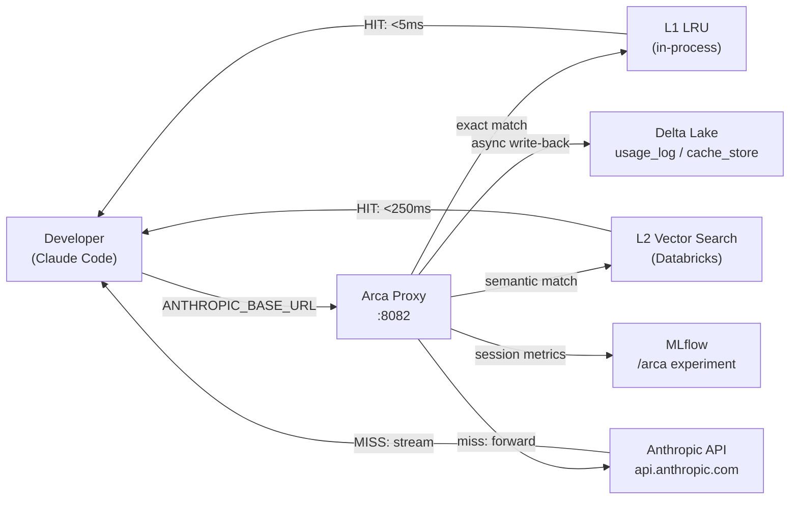

# Arca

A developer using Claude Code pays $0 and waits milliseconds for questions they — or a teammate — have already asked. Exact repeats always hit (L1); semantically-equivalent paraphrases hit when they can be served safely (L2, retrieve-then-verify). Measured cache quality is in [`benchmarks/EVAL_METRICS.md`](benchmarks/EVAL_METRICS.md).

## How It Works



Arca is a local FastAPI proxy that intercepts Claude Code's outgoing Anthropic API calls, embeds each prompt with `BAAI/bge-small-en-v1.5` (384-dim), and serves cached responses from a two-tier cache:

- **L1 LRU** (in-process, keyed on SHA256 of canonical prompt) returns exact-repeat hits in <5ms — 100% precision by construction.
- **L2 Databricks Vector Search** returns semantic paraphrase matches across sessions in <250ms, using a **retrieve-then-verify** pipeline: cosine similarity ≥ 0.90 retrieves candidates, then a deterministic polarity guard ([`arca/semantic_guard.py`](arca/semantic_guard.py)) rejects meaning-flipping near-misses (encode/decode, `X→Y` vs `Y→X`, negation). On a held-out adversarial eval this lifts L2 precision from 75% (cosine-only at 0.95) to **92%** while raising recall, with no measured wrong answers on the validated flips. See [`benchmarks/EVAL_METRICS.md`](benchmarks/EVAL_METRICS.md).
- **Cache miss** forwards to Anthropic, streams the response to the client, then asynchronously writes to Delta + upserts the VS index for next time.

Every call is logged to `demo_jedi.arca.usage_log` for cost analytics, and session metrics land in an MLflow experiment at `/Users/{email}/arca`.

## Quick Start (< 5 minutes)

> **Note:** torch must be installed separately to avoid the CUDA wheel (2 GB). Install the CPU wheel first (see step 1).

```bash
# 1. Install torch CPU wheel FIRST — this step must come before installing Arca
pip install torch==2.4.* --index-url https://download.pytorch.org/whl/cpu

# 2. Install Arca
pip install arca-proxy

# 3. Provision Databricks resources + download embedding model
arca init

# 4. Launch the proxy (detached)
arca start

# 5. Point Claude Code at Arca
export ANTHROPIC_BASE_URL=http://localhost:8082

# 6. Verify all integration points
arca doctor
```

If `arca doctor` shows all 4 checks PASS, you're ready. Run Claude Code normally — the first prompt is a miss, the second identical prompt is an L1 hit in <5ms.

## CLI Reference

| Command | Description |
|---|---|
| `arca init` | Provision Delta schema, VS index status, download embedding model |
| `arca start` | Launch proxy as detached background process (writes `~/.arca/arca.pid`) |
| `arca stop` | Gracefully shut down proxy (SIGTERM via PID file) |
| `arca stats` | Session summary (total calls, hits, misses, hit rate, cost saved) |
| `arca doctor` | Validate Databricks auth, VS index, MLflow, proxy routing |
| `arca tail` | Stream live cache events (hit/miss, latency, similarity, cost) |

## Databricks Setup

Arca reuses the existing `demo_jedi` catalog and `demo-secrets` scope. `arca init` creates:

- Delta schema: `demo_jedi.arca`
- Delta tables: `cache_store` (prompt + embedding + response) and `usage_log` (per-call metrics)
- MLflow experiment: `/Users/{email}/arca`
- Vector Search: Direct Access index `demo_jedi.arca.prompt_index` on `cache_store.embedding` (384 dims, cosine)

Required environment variables:

| Variable | Source |
|---|---|
| `DATABRICKS_HOST` | Workspace URL (e.g. `https://adb-....azuredatabricks.net`) |
| `DATABRICKS_TOKEN` | Personal access token or OAuth token |
| `DATABRICKS_HTTP_PATH` | SQL warehouse HTTP path (Compute → SQL Warehouses → Connection details) |
| `ANTHROPIC_API_KEY` | For cache misses forwarded upstream and for `scripts/demo_seed.py` |

A Lakeview dashboard is auto-provisioned at `arca init` showing daily hits/misses and cost savings — run `arca doctor` to confirm it is reachable.

## Architecture Details

See the Mermaid diagram in [How It Works](#how-it-works). Key design choices:

- **Transparent pass-through:** Arca binds to `127.0.0.1:8082` only (PRXY-06) and forwards `x-api-key` and `Authorization: Bearer` headers untouched. Setting `ANTHROPIC_BASE_URL` is the only client change required.
- **SSE tee pattern:** On a miss, Arca streams chunks to the client while buffering the canonical JSON for later caching — no added latency on the hot path.
- **Circuit breaker:** If Databricks is unreachable, Arca degrades to pure pass-through within 3 failures (500 ms timeout). The developer never experiences a Databricks outage.
- **Async write-back:** All Delta inserts + VS upserts run via `asyncio.to_thread` so the response path never blocks on network I/O.
- **Single uvicorn worker:** Avoids embedding-model RAM duplication and cache-state fragmentation.

## Demo Script

`scripts/demo_seed.py` pre-populates the cache with 10 prompt pairs (real Anthropic responses) so the demo reliably produces at least one L1 hit and one L2 paraphrase hit within the 5-minute interview window:

```bash
python scripts/demo_seed.py
```

During the demo:
1. Ask Claude Code the verbatim first seeded prompt → L1 hit, <5ms.
2. Ask a paraphrase of the second seeded prompt ("Write a Python function to flatten nested lists") → L2 hit (cosine ≥ 0.90, accepted by the polarity guard).
3. Ask a fresh prompt → miss forwarded to Anthropic, streamed to client, asynchronously cached.

Run `arca stats` after the demo to show cumulative hit rate and cost saved.
