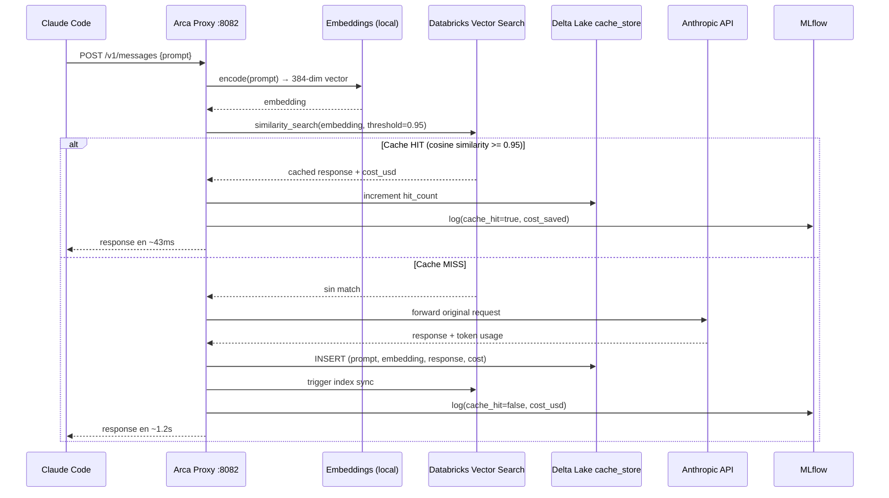
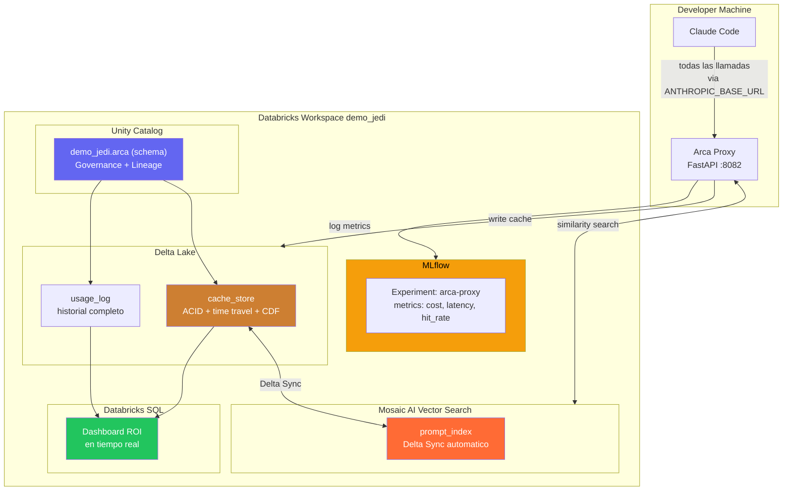
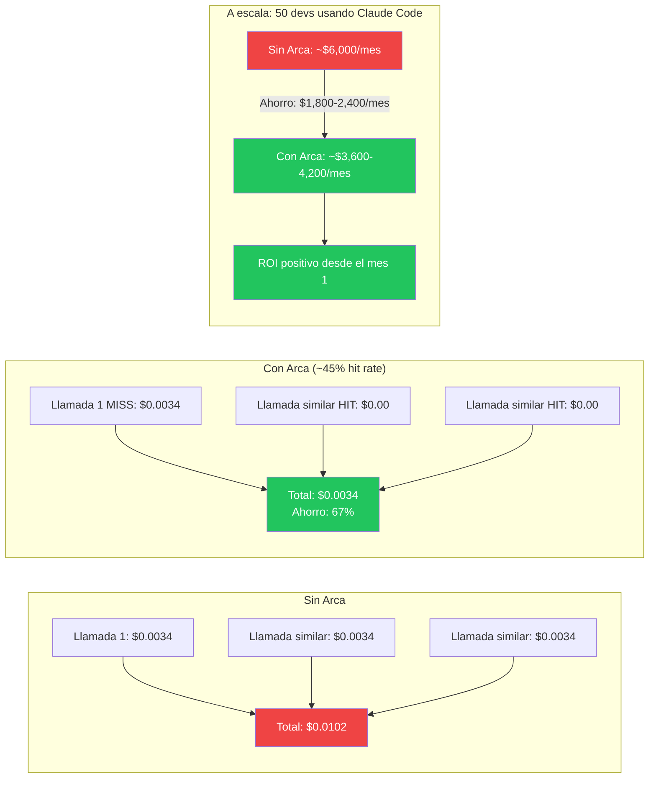
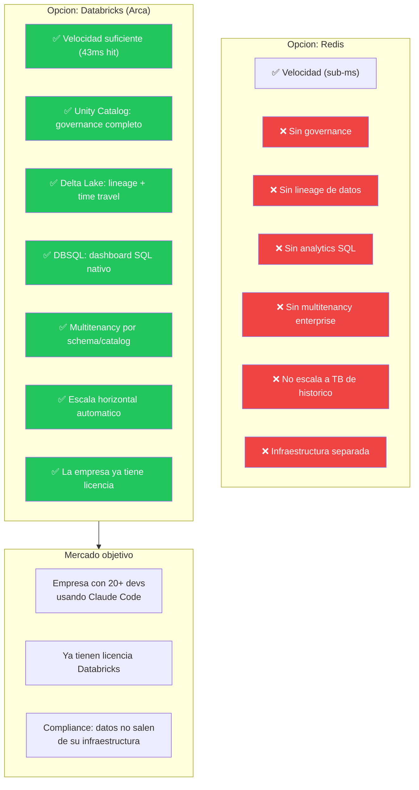

# Arca — Diagramas de Arquitectura

Para usar en la entrevista Databricks y para entender el funcionamiento del sistema.

---

## Diagrama 1 — Flujo de llamada (Sequence)

Muestra qué pasa exactamente cuando Claude Code hace una llamada a Anthropic.

---

## Diagrama 2 — Componentes Databricks

Cómo los 4 productos de Databricks trabajan juntos dentro de Arca.

---

## Diagrama 3 — Valor de negocio

El ROI que justifica Arca para una empresa.

---

## Diagrama 4 — Por qué Databricks y no Redis

El argumento enterprise para usar Databricks como backend de cache.

---

## Cómo presentarlo en la entrevista

**Frase de apertura:**
> "Después de nuestra primera llamada construi algo para demostrar que entiendo Databricks desde adentro. Es un proxy para Claude Code que usa Vector Search para cache semántico y Delta Lake como storage. Corre en el mismo workspace que el POC de 5 agentes."

**Secuencia recomendada:**
1. Muestra Diagrama 2 (componentes Databricks) — ancla el producto en la plataforma
2. Muestra Diagrama 1 (flujo de llamada) — explica la mecánica
3. Muestra Diagrama 3 (ROI) — cierra con el business case
4. Si preguntan por Redis → Diagrama 4
